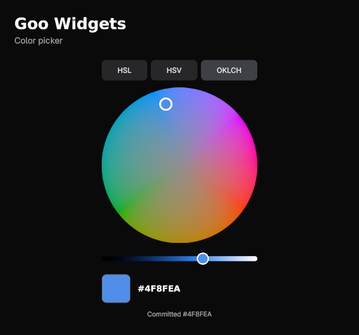
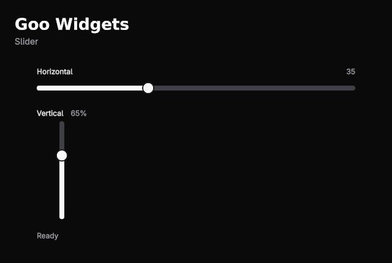
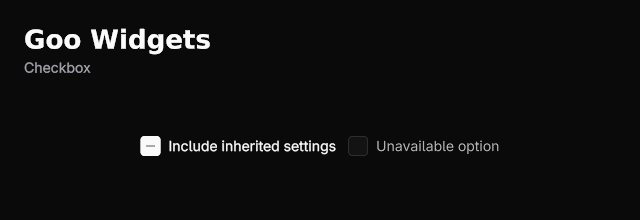

# Goo Widgets post assets

Code and native captures from the current checkout. These APIs are not in published `0.1.1`.

## Draft post

The color picker in Goo Widgets now brings its own HSL / HSV / OKLCH switcher, swatch, and hex readout. Bind a color and handle the callback. Added labels to checkboxes and value readouts to sliders too. All G#.

## Snippets and screenshots

These excerpts come from the compiled gallery cells. Insert them in a host cell’s `Build` method. The linked source files include imports, fields, layout, and supporting controls.

### ColorPicker



[Plain text snippet](ColorPicker.txt) · [Complete source](../../samples/Goo.Widgets.Gallery/Pages/Colors/ColorPickerPage.gs)

```gsharp
Cell.Mount[ColorPickerInput, ColorPicker]("color-picker", ColorPickerInput{
  Value: rgb,
  WheelSize: 260.0,
  OnValueChanged: (value int32) -> { rgb = value
    Rebuild() },
  OnValueCommitted: (value int32) -> { rgb = value
    committed = value
    Rebuild() },
})
```

### Slider



[Plain text snippet](Slider.txt) · [Complete source](../../samples/Goo.Widgets.Gallery/Pages/Inputs/SliderPage.gs)

```gsharp
Cell.Mount[SliderInput, Slider]("horizontal-slider", SliderInput{
  Label: "Horizontal",
  ShowValue: true,
  Value: horizontal,
  Minimum: 0.0,
  Maximum: 100.0,
  Step: 5.0,
  OnValueChanged: (value float64) -> { horizontal = value
    status = "Preview " + value.ToString("0")
    Rebuild() },
  OnValueCommitted: (value float64) -> { horizontal = value
    status = "Committed " + value.ToString("0")
    Rebuild() },
})
```

### Checkbox



[Plain text snippet](Checkbox.txt) · [Complete source](../../samples/Goo.Widgets.Gallery/Pages/Inputs/CheckboxPage.gs)

```gsharp
Checkbox{
  Label: "Include inherited settings",
  State: state,
  AllowMixed: true,
  OnChange: (next AccessibilityChecked) -> { state = next },
}.Build()
```

## Capture again

```sh
dotnet build Goo.Widgets.slnx -c Release

dotnet run --project samples/Goo.Widgets.Gallery -c Release --no-build -- --spotlight docs/social --page "Color picker"

dotnet run --project samples/Goo.Widgets.Gallery -c Release --no-build -- --spotlight docs/social --page "Slider"

dotnet run --project samples/Goo.Widgets.Gallery -c Release --no-build -- --spotlight docs/social --page "Checkbox"

```
